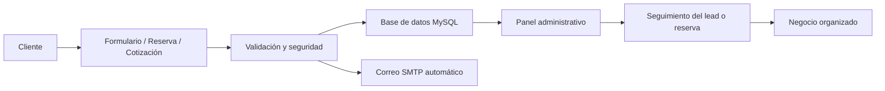

# Hola, soy Alejandro Villegas

### Desarrollador Web Full Stack · Fundador de Nubira Web

Creo sitios web profesionales, catálogos digitales, formularios conectados, paneles administrativos, APIs y sistemas web para negocios reales.

---

## Sobre mí

Soy desarrollador web Full Stack enfocado en crear soluciones digitales funcionales para negocios reales.

No me limito a crear páginas visualmente atractivas. Desarrollo experiencias completas que pueden incluir:

- Diseño responsive.
- Formularios conectados.
- Bases de datos.
- Correos automáticos por SMTP.
- Paneles administrativos.
- Mini CRM.
- Sistemas de reservas.
- APIs y dashboards.
- Publicación en hosting real.

Mi objetivo es construir soluciones que se vean profesionales, generen confianza y ayuden a un negocio a operar mejor.

---

## Full Stack en acción

---

## Proyectos destacados

| Proyecto | Qué demuestra | Enlace |
|---|---|---|
| **Nubira Web** | Sitio profesional con portafolio, configurador de proyectos, servicios y demos funcionales. | [Ver sitio](https://nubiraweb.com/) |
| **AgendaPro Showcase** | Sistema de reservas con disponibilidad, confirmación, estados, correos automáticos y panel privado. | [Ver repositorio](https://github.com/alejandrovillegasricaurte20111-star/agendapro-showcase) |
| **Artesanal Soap Case Study** | Caso real de sitio comercial con catálogo, detalle de producto, cotización y diseño responsive. | [Ver repositorio](https://github.com/alejandrovillegasricaurte20111-star/artesanal-soap-case-study) |
| **Nubira Web Stack Showcase** | Presentación técnica con React, Node.js, APIs, PHP, MySQL, dashboards y arquitectura moderna. | [Ver repositorio](https://github.com/alejandrovillegasricaurte20111-star/nubiraweb-stack-showcase) |

---

## Qué hay detrás de mis proyectos

| Área | Implementación |
|---|---|
| **Frontend** | HTML, CSS, JavaScript, diseño responsive e interfaces modernas. |
| **Backend** | PHP, validaciones, procesamiento de formularios y lógica de negocio. |
| **Base de datos** | MySQL para leads, reservas, solicitudes y registros administrativos. |
| **Automatización** | Correos automáticos por SMTP, confirmaciones y avisos internos. |
| **Paneles privados** | Gestión de reservas, estados, clientes, filtros y seguimiento. |
| **Stack moderno** | React, Node.js, APIs y dashboards interactivos. |
| **Publicación** | cPanel, hosting, dominios, estructura segura y despliegue real. |
| **Mantenimiento** | GitHub privado, backups, releases y flujo ordenado de cambios. |

---

## Qué puedo construir

- Sitios web profesionales para marcas, servicios y negocios.
- Landing pages comerciales enfocadas en conversión.
- Catálogos digitales con productos, fichas y formularios de cotización.
- Sistemas de reservas y solicitudes con confirmaciones automáticas.
- Paneles administrativos para gestionar clientes, leads o registros.
- Formularios conectados a base de datos y correo SMTP.
- Demos funcionales para validar ideas antes de desarrollar sistemas más grandes.

---

## Enfoque de trabajo

Me gusta desarrollar con una idea clara: que cada proyecto tenga utilidad real.

Por eso cuido tanto la parte visual como la parte funcional: estructura, experiencia de usuario, velocidad, seguridad básica, orden en el código, comunicación por correo, almacenamiento de información y facilidad de administración.

---

## Actualmente trabajando en

- Mejora continua de **Nubira Web** como marca profesional.
- Desarrollo y presentación de demos Full Stack.
- Sistemas web para negocios con formularios, paneles y automatizaciones.
- Proyectos PHP/MySQL compatibles con hosting real en cPanel.
- Integraciones modernas con JavaScript, React, Node.js y APIs.

---

### ¿Quieres ver más?

