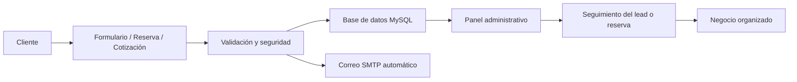

<h1 align="center">Hola, soy Alejandro 👋</h1>

<p align="center">
  <strong>Desarrollador Web Full Stack · Fundador de Nubira Web</strong>
</p>

<p align="center">
  Creo sitios web profesionales, catálogos digitales, formularios conectados, paneles administrativos, APIs y sistemas web para negocios reales.
</p>

<p align="center">
  <a href="https://nubiraweb.com/">
    
  </a>
  <a href="https://nubiraweb.com/configurar-proyecto.php">
    
  </a>
  <a href="mailto:contacto@nubiraweb.com">
    
  </a>
</p>

<p align="center">
  
  
  
  
  
  
  
</p>

---

## 🚀 Sobre mí

Soy desarrollador web Full Stack enfocado en crear soluciones digitales funcionales para negocios reales.

No me limito a crear páginas visualmente atractivas. Desarrollo experiencias completas que pueden incluir:

- diseño responsive
- formularios conectados
- base de datos
- correos automáticos
- paneles administrativos
- mini CRM
- sistemas de reservas
- APIs y dashboards
- publicación en hosting real

Mi objetivo es construir soluciones que se vean profesionales, generen confianza y ayuden a un negocio a operar mejor.

---

## 🧠 Full Stack en acción



---

## 🧩 Proyectos destacados

| Proyecto | Qué demuestra | Enlace |
|---|---|---|
| **Nubira Web** | Sitio profesional con portafolio, configurador de proyectos, mini CRM interno y demos funcionales. | <a href="https://nubiraweb.com/"></a> |
| **AgendaPro** | Sistema de reservas con disponibilidad, confirmación, estados, correos automáticos y panel privado. | <a href="https://nubiraweb.com/agendapro.php"></a> |
| **Panel AgendaPro** | Panel administrativo para gestionar reservas, estados, clientes y seguimiento. | <a href="https://nubiraweb.com/agendapro-demo-panel.php"></a> |
| **Artesanal Soap** | Caso real de sitio comercial con catálogo, detalle de producto, cotización y experiencia responsive. | <a href="https://nubiraweb.com/proyecto-artesanal-soap.php"></a> |
| **Stack avanzado** | Presentación técnica con React, Node.js, APIs, PHP, MySQL, dashboards y arquitectura moderna. | <a href="https://nubiraweb.com/stack-avanzado.php"></a> |

---

## ⚙️ Qué hay detrás de mis proyectos

| Área | Implementación |
|---|---|
| **Frontend** | HTML, CSS, JavaScript, diseño responsive, interfaces modernas |
| **Backend** | PHP, validaciones, procesamiento de formularios, lógica de negocio |
| **Base de datos** | MySQL, almacenamiento de leads, reservas y solicitudes |
| **Automatización** | Correos automáticos por SMTP, confirmaciones y avisos internos |
| **Paneles privados** | Gestión de reservas, estados, leads, filtros y exportación |
| **Stack moderno** | React, Node.js, APIs y dashboards interactivos |
| **Publicación** | cPanel, hosting, dominios, estructura segura para producción |
| **Control de versiones** | GitHub privado, releases, backups seguros y flujo de mantenimiento |

---

## 🛠️ Tecnologías

<p>
  
  
  
  
  
  
  
  
</p>

---

## 💼 Qué puedo construir

- Sitios web profesionales
- Landing pages comerciales
- Catálogos digitales
- Formularios conectados a correo y base de datos
- Sistemas de reservas
- Paneles administrativos
- Mini CRM para leads
- Dashboards internos
- Automatizaciones básicas
- APIs y módulos personalizados
- Sitios responsive para PC, tablet y móvil

---

## 🎯 Mi enfoque de trabajo

```text
1. Entender la necesidad real del negocio.
2. Diseñar una experiencia clara, moderna y profesional.
3. Construir una estructura responsive para todos los dispositivos.
4. Conectar formularios, correos y base de datos.
5. Agregar paneles, automatizaciones o sistemas si el proyecto lo necesita.
6. Publicar, probar y dejar una base lista para mantenimiento.
```

---

## 📌 Proyecto principal

### Nubira Web

**Nubira Web** es mi marca profesional y mi proyecto principal.

Incluye sitio público, portafolio, configurador de proyectos, demo de sistema de reservas, panel administrativo, mini CRM interno y presentación de stack avanzado.

<a href="https://nubiraweb.com/">
  
</a>

---

## 📫 Contacto

**Web:**  
https://nubiraweb.com/

**Correo:**  
contacto@nubiraweb.com

---

<p align="center">
  <strong>Nubira Web · Sitios y sistemas que hacen que tu negocio se vea y funcione mejor.</strong>
</p>
